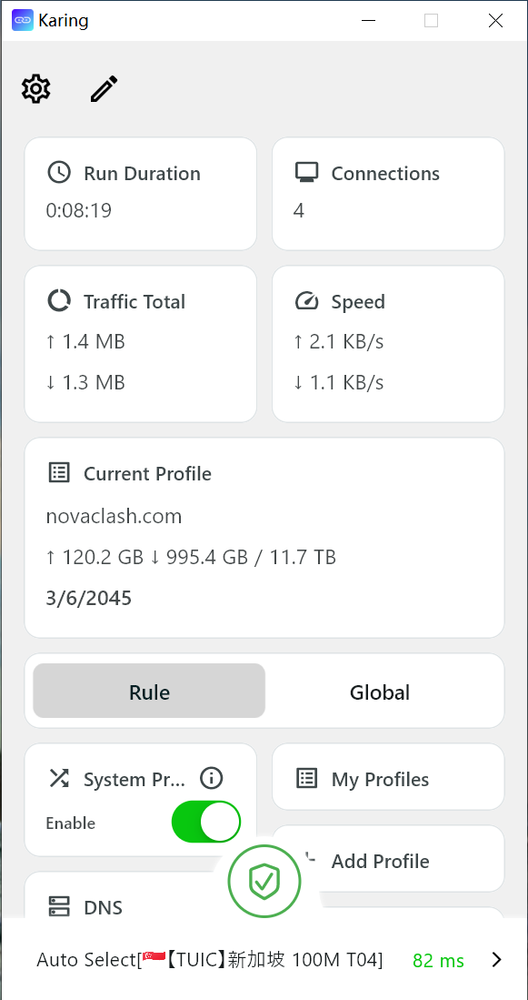
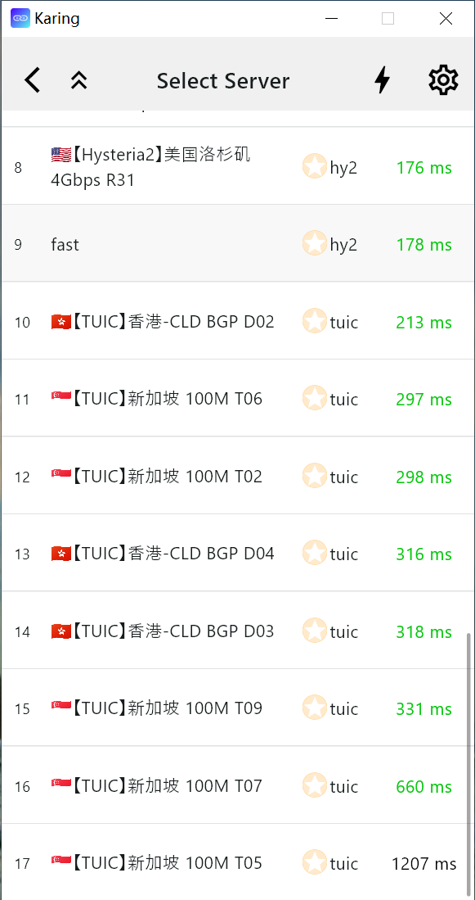
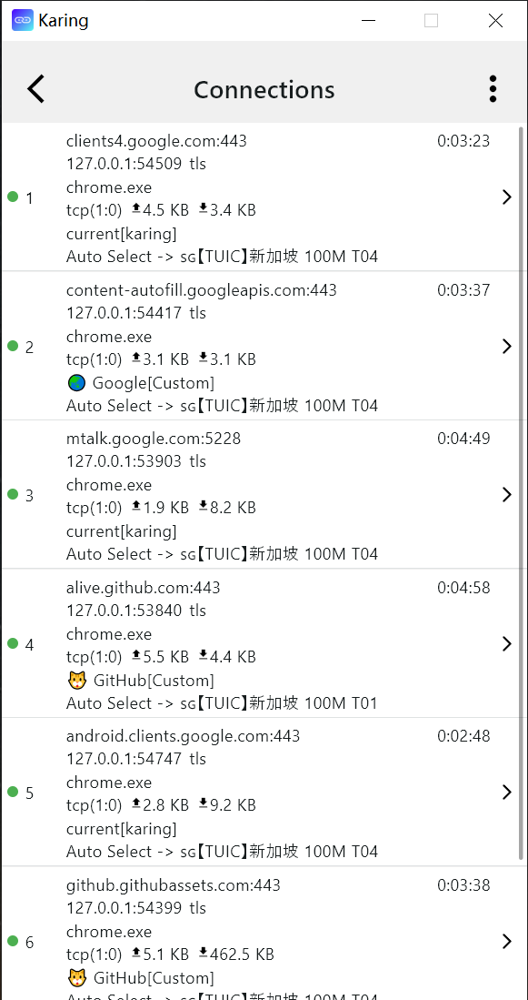
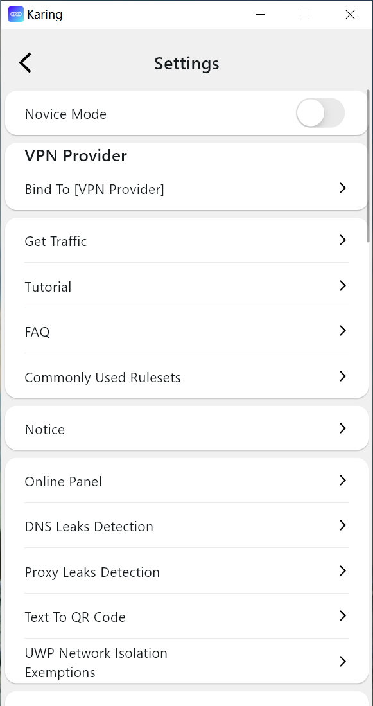
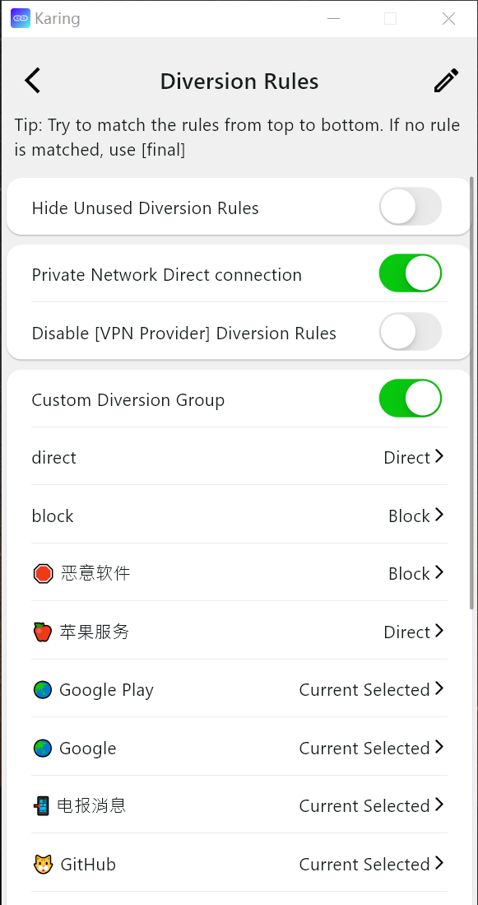
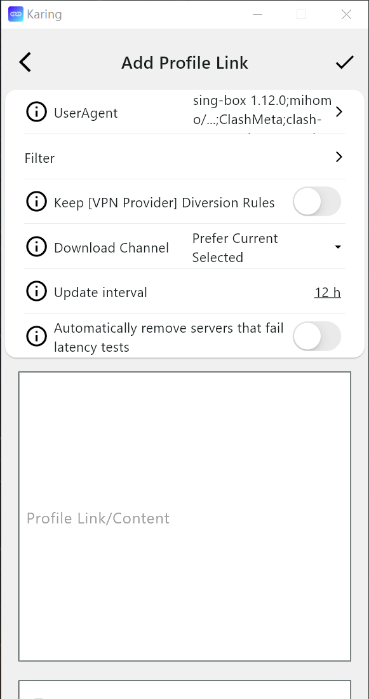

<div align="center">

# singbox-client

**A Karing-based sing-box GUI client built to pair with
[singbox-vpn](https://github.com/David610/singbox-vpn).**

Admin deploys singbox-vpn on a VPS → you scan the QR / import the
subscription URL → connect.

<br>

`VLESS + REALITY` &nbsp; `Hysteria2` &nbsp; `sing-box 1.13.19`

<br>


</div>

### One server, one client.

```text
┌──────────────┐          ┌──────────────┐          ┌──────────────────┐
│ singbox-vpn  │          │ QR / sub URL │          │  singbox-client  │
│ VPS (Rust)   │ ───────► │ subscription │ ───────► │  Android / iOS   │
└──────────────┘          └──────────────┘          └──────────────────┘
```

## What this is

This repository started as a fork of [KaringX/karing](https://github.com/KaringX/karing),
a Flutter-based sing-box GUI. The fork replaced Karing's private, missing
`vpn_service` package with a first-party engine (`packages/vpn_core`) built
on a **pinned public `sing-box`/`libbox` revision**, and treats
[David610/singbox-vpn](https://github.com/David610/singbox-vpn) as its target
server: both projects independently pin `sing-box 1.13.19`, and the client's
config generation is regression-tested against the server's own renderer
output.

You do not need to understand UUIDs, REALITY keys, Hysteria2 passwords,
ports, or JSON to use it — the subscription URL/QR produced by the server
carries everything the client needs.

## Protocol support

| Protocol | Support |
|---|---|
| VLESS + REALITY (XTLS-Vision flow) | Yes |
| VLESS + REALITY (flow omitted — `vision-off`) | Yes |
| Hysteria2 (+ Salamander obfuscation) | Yes |
| Subscription URL import (`GET /sub/{token}`) | Yes |
| `vless://` / `hysteria2://` URIs, sing-box JSON profiles | Yes |

Status, honestly: the parser layer, config generation, and headless
protocol handshakes against a real pinned `sing-box` binary are verified in
CI on every change. **Real-device end-to-end validation (Android/iOS) has
not been performed yet.** See
[docs/SINGBOX_VPN_COMPATIBILITY.md](docs/SINGBOX_VPN_COMPATIBILITY.md) for
the full matrix and
[docs/CI.md](docs/CI.md) for exactly what CI does and does not prove.

## Connecting to a singbox-vpn server

1. The server administrator creates your account:
   `sudo vpn user create --name you --qr`
2. In this app, add a profile by scanning the printed QR code or pasting
   the subscription URL.
3. Select REALITY or Hysteria2 and connect.

Server-side setup, user management, and troubleshooting are documented in
the [singbox-vpn repository](https://github.com/David610/singbox-vpn)
([installation](https://github.com/David610/singbox-vpn/blob/main/docs/INSTALLATION.md),
[client onboarding](https://github.com/David610/singbox-vpn/tree/main/docs/clients)).
What the generated subscription controls — and what (tunneling mode, DNS,
IPv4/IPv6, kill switch) remains the client OS's decision — is specified once
in
[CLIENT_PROTOCOL_BEHAVIOR.md](https://github.com/David610/singbox-vpn/blob/main/docs/CLIENT_PROTOCOL_BEHAVIOR.md).

## Getting the app

No binary releases are published yet. Until then, build from source:
see **[docs/BUILDING.md](docs/BUILDING.md)**.

System requirements:

- Android >= 8 (arm64-v8a, armeabi-v7a)
- iOS >= 15

## Screenshots

<div align="center">
  
  </br></br>
  
    </br></br>
  
  </br></br>
  
  </br></br>
  
  </br></br>
  
</div>

## Documentation

- [Architecture](docs/ARCHITECTURE.md) — the VPN engine boundary and why
  `packages/vpn_core` exists
- [Building](docs/BUILDING.md) — how to build each piece from source
- [singbox-vpn compatibility matrix](docs/SINGBOX_VPN_COMPATIBILITY.md) —
  validated feature-by-feature against the target server
- [Credential storage](docs/CREDENTIAL_STORAGE.md) — where profile secrets
  live and what backups contain
- [CI](docs/CI.md) — every workflow, and what green explicitly does not prove

## Acknowledgements

Based on [Karing](https://github.com/KaringX/karing):

- [flutter](https://flutter.dev/): makes it easy and fast to build beautiful apps for mobile and beyond.
- [sing-box](https://sing-box.sagernet.org/): The universal proxy platform.

## License

Licensing of the combined work (this repository's original code +
Karing-derived code + statically included GPL-3.0 sing-box) is **not yet
resolved** — see [LICENSE](LICENSE), [LICENSE.md](LICENSE.md), and
[docs/LICENSING_AUDIT.md](docs/LICENSING_AUDIT.md) before redistributing
anything from this repository.
